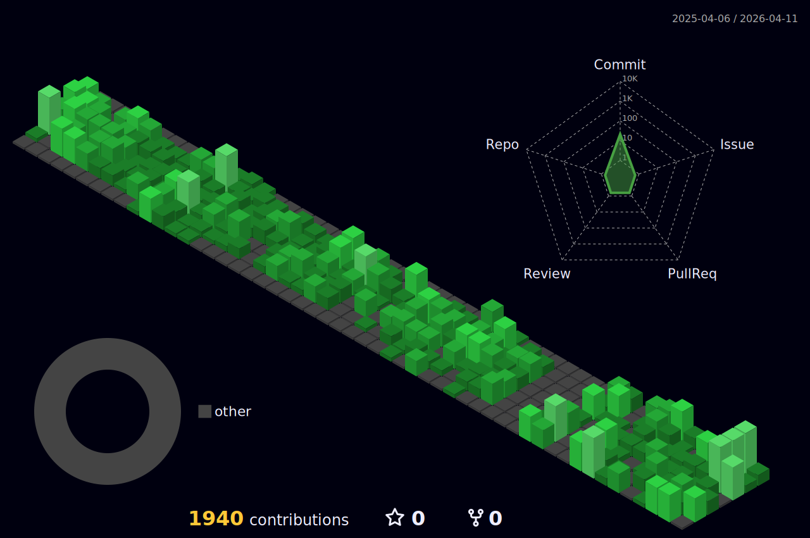

# 👨🏽‍💻

 **📚 Learn more about my** [projects](https://patrickmoreira.netlify.app/)  
 **💼 Connect with me on** [LinkedIn](https://linkedin.com/in/patrick-moreirarosa/)

---

##  Skills   
<div align="center">
<a href="https://skillicons.dev">
  
</a>
</div>

## 🏆 GitHub Trophies
<div align="center">


</div>

## 📊 Stats
<div align="center">


<br/>

</div>

<!--START_SECTION:waka-->

```txt
From: 18 February 2026 - To: 25 February 2026

Total Time: 33 hrs 59 mins

TypeScript   24 hrs 4 mins         ⣿⣿⣿⣿⣿⣿⣿⣿⣿⣿⣿⣿⣿⣿⣿⣿⣿⣶⣀⣀⣀⣀⣀⣀⣀   70.84 %
Bash         2 hrs 54 mins         ⣿⣿⣄⣀⣀⣀⣀⣀⣀⣀⣀⣀⣀⣀⣀⣀⣀⣀⣀⣀⣀⣀⣀⣀⣀   08.56 %
Other        2 hrs 26 mins         ⣿⣷⣀⣀⣀⣀⣀⣀⣀⣀⣀⣀⣀⣀⣀⣀⣀⣀⣀⣀⣀⣀⣀⣀⣀   07.20 %
Markdown     1 hr 27 mins          ⣿⣀⣀⣀⣀⣀⣀⣀⣀⣀⣀⣀⣀⣀⣀⣀⣀⣀⣀⣀⣀⣀⣀⣀⣀   04.27 %
Python       1 hr 19 mins          ⣿⣀⣀⣀⣀⣀⣀⣀⣀⣀⣀⣀⣀⣀⣀⣀⣀⣀⣀⣀⣀⣀⣀⣀⣀   03.92 %
JSON         1 hr 5 mins           ⣷⣀⣀⣀⣀⣀⣀⣀⣀⣀⣀⣀⣀⣀⣀⣀⣀⣀⣀⣀⣀⣀⣀⣀⣀   03.19 %
Git Config   33 mins               ⣤⣀⣀⣀⣀⣀⣀⣀⣀⣀⣀⣀⣀⣀⣀⣀⣀⣀⣀⣀⣀⣀⣀⣀⣀   01.62 %
JavaScript   5 mins                ⣀⣀⣀⣀⣀⣀⣀⣀⣀⣀⣀⣀⣀⣀⣀⣀⣀⣀⣀⣀⣀⣀⣀⣀⣀   00.27 %
CSV          1 min                 ⣀⣀⣀⣀⣀⣀⣀⣀⣀⣀⣀⣀⣀⣀⣀⣀⣀⣀⣀⣀⣀⣀⣀⣀⣀   00.07 %
Docker       0 secs                ⣀⣀⣀⣀⣀⣀⣀⣀⣀⣀⣀⣀⣀⣀⣀⣀⣀⣀⣀⣀⣀⣀⣀⣀⣀   00.03 %
```

<!--END_SECTION:waka-->

---



[](https://visitcount.itsvg.in)
