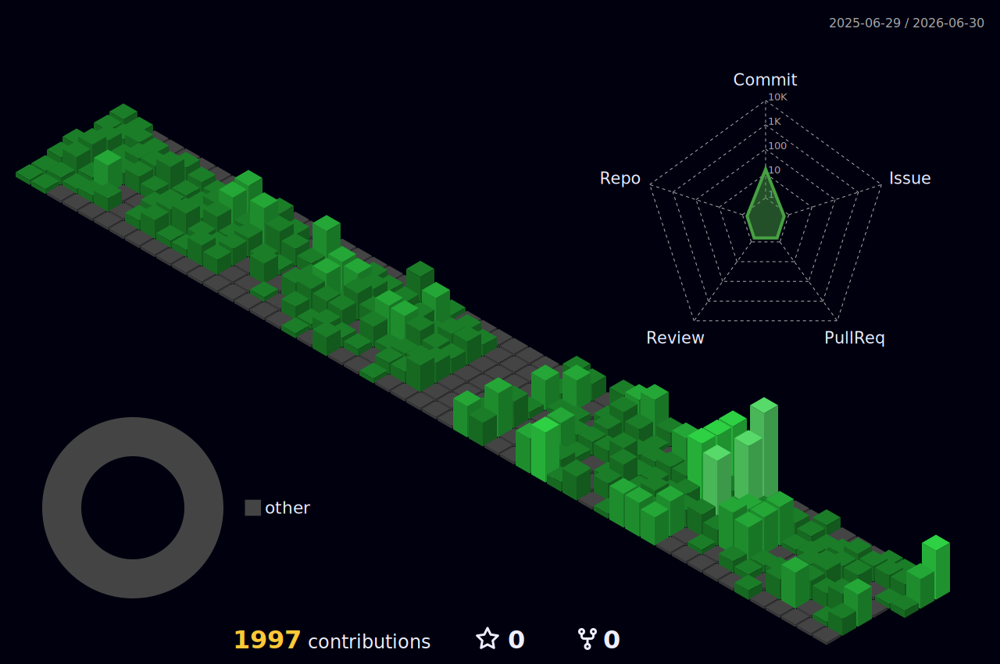

# 👨🏽‍💻

 **📚 Learn more about my** [projects](https://patrickmoreira.netlify.app/)  
 **💼 Connect with me on** [LinkedIn](https://linkedin.com/in/patrick-moreirarosa/)

---

##  Skills   
<div align="center">
<a href="https://skillicons.dev">
  
</a>
</div>

## 🏆 GitHub Trophies
<div align="center">


</div>

## 📊 Stats
<div align="center">


<br/>

</div>

<!--START_SECTION:waka-->

```txt
From: 01 April 2026 - To: 08 April 2026

Total Time: 14 hrs 46 mins

TypeScript   4 hrs 25 mins         ⣿⣿⣿⣿⣿⣿⣿⣦⣀⣀⣀⣀⣀⣀⣀⣀⣀⣀⣀⣀⣀⣀⣀⣀⣀   29.91 %
Other        4 hrs 18 mins         ⣿⣿⣿⣿⣿⣿⣿⣤⣀⣀⣀⣀⣀⣀⣀⣀⣀⣀⣀⣀⣀⣀⣀⣀⣀   29.09 %
Markdown     2 hrs 42 mins         ⣿⣿⣿⣿⣶⣀⣀⣀⣀⣀⣀⣀⣀⣀⣀⣀⣀⣀⣀⣀⣀⣀⣀⣀⣀   18.34 %
JSON         43 mins               ⣿⣄⣀⣀⣀⣀⣀⣀⣀⣀⣀⣀⣀⣀⣀⣀⣀⣀⣀⣀⣀⣀⣀⣀⣀   04.85 %
YAML         42 mins               ⣿⣄⣀⣀⣀⣀⣀⣀⣀⣀⣀⣀⣀⣀⣀⣀⣀⣀⣀⣀⣀⣀⣀⣀⣀   04.85 %
Bash         33 mins               ⣿⣀⣀⣀⣀⣀⣀⣀⣀⣀⣀⣀⣀⣀⣀⣀⣀⣀⣀⣀⣀⣀⣀⣀⣀   03.77 %
Docker       23 mins               ⣶⣀⣀⣀⣀⣀⣀⣀⣀⣀⣀⣀⣀⣀⣀⣀⣀⣀⣀⣀⣀⣀⣀⣀⣀   02.66 %
JavaScript   17 mins               ⣦⣀⣀⣀⣀⣀⣀⣀⣀⣀⣀⣀⣀⣀⣀⣀⣀⣀⣀⣀⣀⣀⣀⣀⣀   02.02 %
Caddyfile    12 mins               ⣤⣀⣀⣀⣀⣀⣀⣀⣀⣀⣀⣀⣀⣀⣀⣀⣀⣀⣀⣀⣀⣀⣀⣀⣀   01.41 %
SQL          11 mins               ⣤⣀⣀⣀⣀⣀⣀⣀⣀⣀⣀⣀⣀⣀⣀⣀⣀⣀⣀⣀⣀⣀⣀⣀⣀   01.30 %
```

<!--END_SECTION:waka-->

---



[](https://visitcount.itsvg.in)
