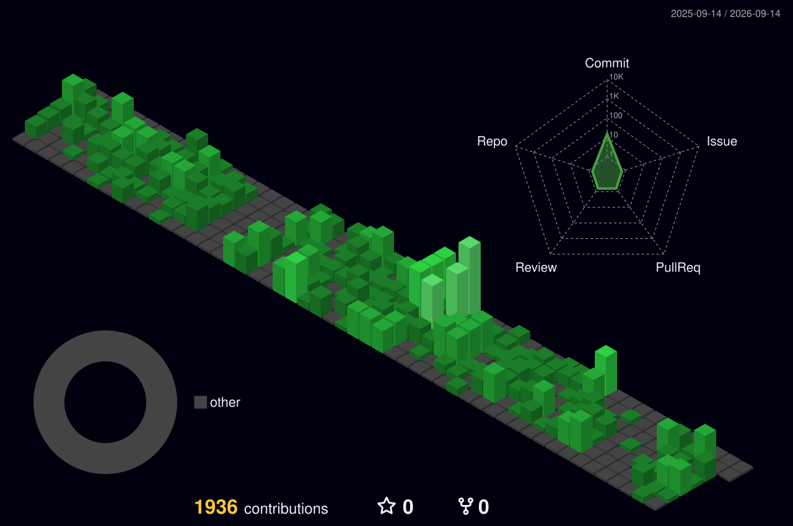

# 👨🏽‍💻

 **📚 Learn more about my** [projects](https://patrickmoreira.netlify.app/)  
 **💼 Connect with me on** [LinkedIn](https://linkedin.com/in/patrick-moreirarosa/)

---

##  Skills   
<div align="center">
<a href="https://skillicons.dev">
  
</a>
</div>

## 🏆 GitHub Trophies
<div align="center">


</div>

## 📊 Stats
<div align="center">


<br/>

</div>

<!--START_SECTION:waka-->

```txt
From: 20 July 2026 - To: 27 July 2026

Total Time: 1 hr 41 mins

TypeScript   41 mins               ⣿⣿⣿⣿⣿⣿⣿⣿⣿⣿⣄⣀⣀⣀⣀⣀⣀⣀⣀⣀⣀⣀⣀⣀⣀   40.96 %
Markdown     36 mins               ⣿⣿⣿⣿⣿⣿⣿⣿⣿⣄⣀⣀⣀⣀⣀⣀⣀⣀⣀⣀⣀⣀⣀⣀⣀   36.38 %
YAML         11 mins               ⣿⣿⣷⣀⣀⣀⣀⣀⣀⣀⣀⣀⣀⣀⣀⣀⣀⣀⣀⣀⣀⣀⣀⣀⣀   11.59 %
Bash         5 mins                ⣿⣤⣀⣀⣀⣀⣀⣀⣀⣀⣀⣀⣀⣀⣀⣀⣀⣀⣀⣀⣀⣀⣀⣀⣀   05.58 %
Python       5 mins                ⣿⣤⣀⣀⣀⣀⣀⣀⣀⣀⣀⣀⣀⣀⣀⣀⣀⣀⣀⣀⣀⣀⣀⣀⣀   05.49 %
```

<!--END_SECTION:waka-->

---



[](https://visitcount.itsvg.in)
