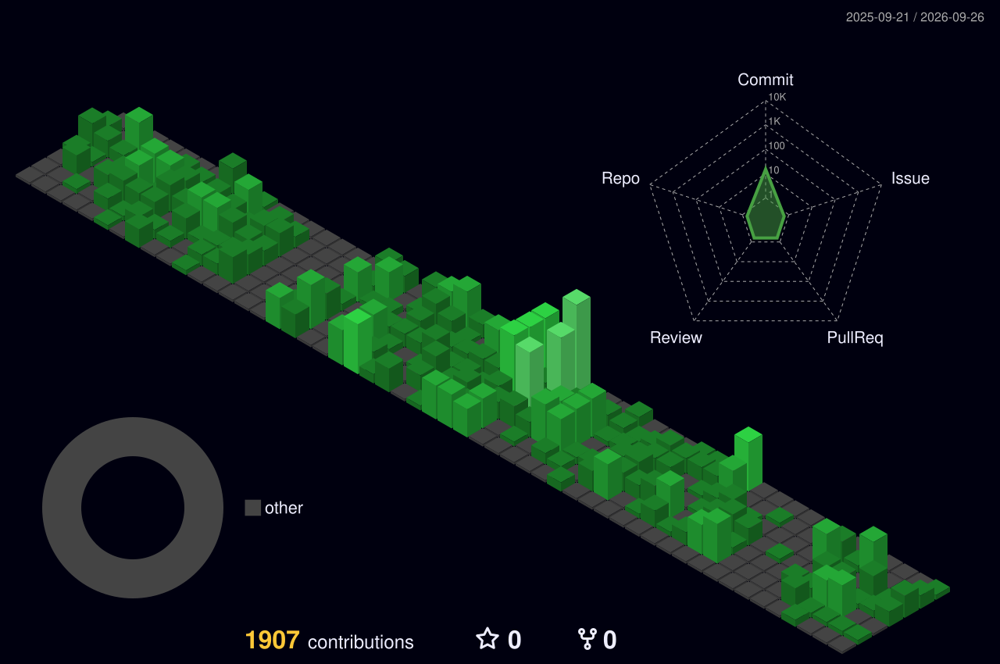

# 👨🏽‍💻

 **📚 Learn more about my** [projects](https://patrickmoreira.netlify.app/)  
 **💼 Connect with me on** [LinkedIn](https://linkedin.com/in/patrick-moreirarosa/)

---

##  Skills   
<div align="center">
<a href="https://skillicons.dev">
  
</a>
</div>

## 🏆 GitHub Trophies
<div align="center">


</div>

## 📊 Stats
<div align="center">


<br/>

</div>

<!--START_SECTION:waka-->

```txt
From: 26 September 2026 - To: 03 October 2026

Total Time: 2 hrs 11 mins

Markdown     55 mins               ⣿⣿⣿⣿⣿⣿⣿⣿⣿⣿⣦⣀⣀⣀⣀⣀⣀⣀⣀⣀⣀⣀⣀⣀⣀   42.29 %
Python       33 mins               ⣿⣿⣿⣿⣿⣿⣤⣀⣀⣀⣀⣀⣀⣀⣀⣀⣀⣀⣀⣀⣀⣀⣀⣀⣀   25.21 %
Bash         21 mins               ⣿⣿⣿⣿⣄⣀⣀⣀⣀⣀⣀⣀⣀⣀⣀⣀⣀⣀⣀⣀⣀⣀⣀⣀⣀   16.36 %
JavaScript   7 mins                ⣿⣦⣀⣀⣀⣀⣀⣀⣀⣀⣀⣀⣀⣀⣀⣀⣀⣀⣀⣀⣀⣀⣀⣀⣀   05.73 %
JSON         5 mins                ⣿⣀⣀⣀⣀⣀⣀⣀⣀⣀⣀⣀⣀⣀⣀⣀⣀⣀⣀⣀⣀⣀⣀⣀⣀   04.09 %
Other        5 mins                ⣿⣀⣀⣀⣀⣀⣀⣀⣀⣀⣀⣀⣀⣀⣀⣀⣀⣀⣀⣀⣀⣀⣀⣀⣀   04.04 %
CSS          2 mins                ⣦⣀⣀⣀⣀⣀⣀⣀⣀⣀⣀⣀⣀⣀⣀⣀⣀⣀⣀⣀⣀⣀⣀⣀⣀   01.81 %
HTML         0 secs                ⣄⣀⣀⣀⣀⣀⣀⣀⣀⣀⣀⣀⣀⣀⣀⣀⣀⣀⣀⣀⣀⣀⣀⣀⣀   00.46 %
```

<!--END_SECTION:waka-->

---



[](https://visitcount.itsvg.in)
