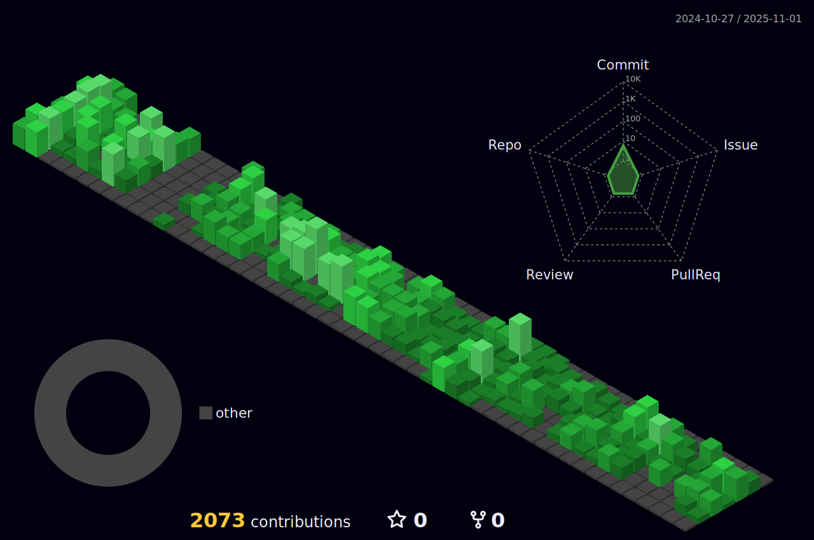

# Hi, welcome to my github profile 👨🏽‍💻
- Learn more about my [projects](https://patrickmoreira.netlify.app/) 📚💡  
- Send me a message on 

---

##  Skills  
  

   

  

## 🏆 GitHub Trophies

  

## 📊 Stats

  
 

---

